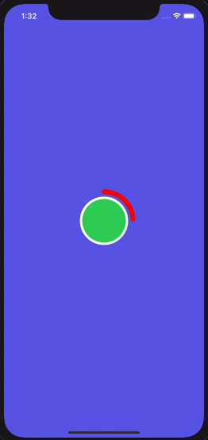

# CircleProgressAnimation
CircleProgressAnimation helps to apply progress animation to all views

## Usage
let view = UIView() //UIbutton //UIImageView etc..

view.circleProgressAnimation(duration: 20,radius: 5)

The progress will automatically remove form super view,also we Can able to remove the animation before the time ends

view.removeCircleProgressAnimation()

### Demo

